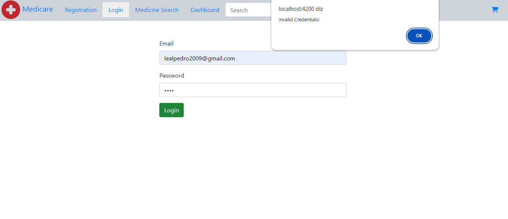
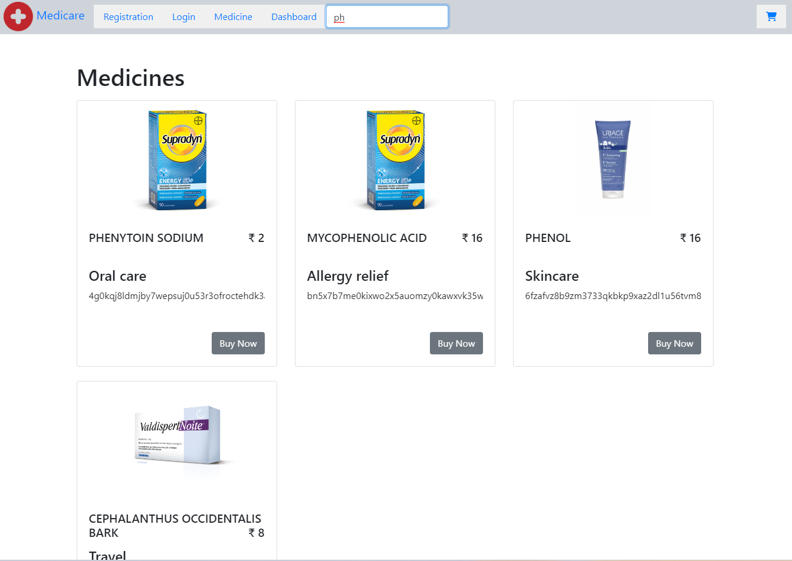
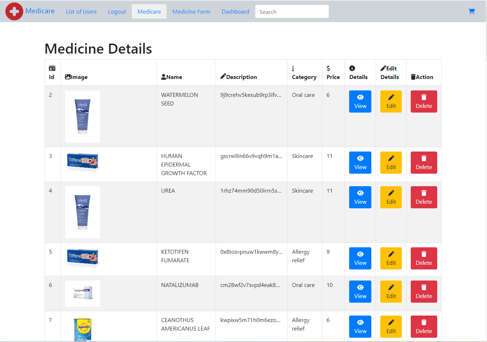
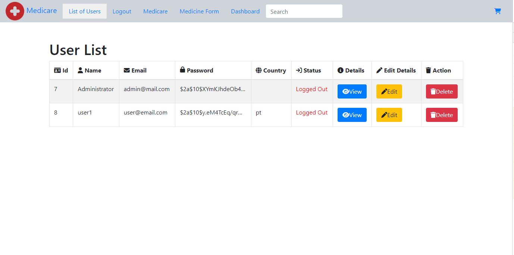
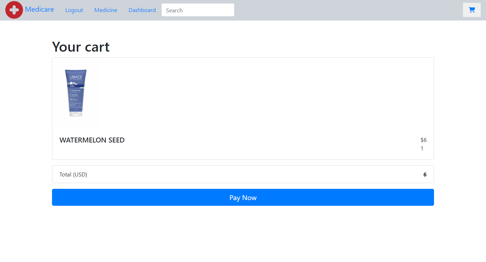
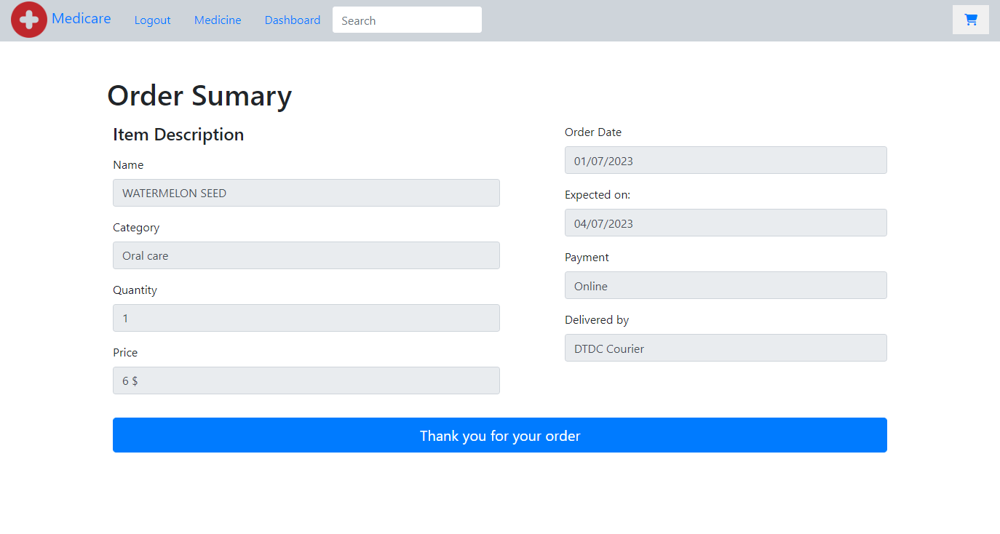

# Medicare


Medicare is a company that supplies medicines and a couple of other healthcare essentials at an affordable price. It was established in 2012 in Delhi, India. It had been serving fine all these years, however, the business analysts noticed a decline in sales since 2017. They found out that online ordering of medicines with companies, such as 100mg and mfine are gaining more profits by eliminating middlemen from the equation. As a result, the team decided to hire a Full Stack developer to develop a healthcare web application with a rich and user-friendly interface.
I was  hired as the Full Stack Java developer and are asked to develop the web application. The management team has provided me with the requirements and their business model so that I can easily arrange different components of the application.

## Technology

| Technology | Version |
| ------ | ------- |
| Spring Boot | 2.7.10 |
| Spring Data Jpa, Spring Web | --- |
| Lombok  | --- |
| Angular | 14 |
| MySql | 8 |
| Bootsrap | 5 |
| Spring Security Starter | --- | 

## Key Features
[Specification Document](./capstone.pdf)  
**Authentication**
* Administrator can sign in, customers can sign in/ sign up
* Invalid Login attemps trigger error alert

```java
@RestController
@RequestMapping("/api/auth")
@CrossOrigin(origins = "*")
public class AuthController {
	
	@Autowired AuthenticationManager authenticationManager;
	@Autowired JwtTokenUtil jwtUtil;
	@Autowired
	private UserDetailService userDetailService;
	
	@PostMapping("/login")
	public ResponseEntity<?> generateToken(@RequestBody AuthRequest authRequest) throws Exception{
		
		try {
			authenticate(authRequest.getEmail(), authRequest.getPassword());
		}catch(UsernameNotFoundException e) {
			e.printStackTrace();
			throw new Exception("User does not exist or invalid credentials!");
		}
		// validated
		UserDetails userDetails = this.userDetailService.loadUserByUsername(authRequest.getEmail());
		String token = this.jwtUtil.generateToken(userDetails);
		return ResponseEntity.ok(new AuthResponse(token));
	}
	...

}
```

```typescript
import { Component, OnInit } from '@angular/core';
import { ActivatedRoute, Router } from '@angular/router';
import { DataService } from '../data.service';
import { UserClass } from '../UserClass';
import { EmailValidator } from '@angular/forms';
import { Credentials } from '../models/credentials';
import { LoginService } from '../login.service';

@Component({
  selector: 'app-login',
  templateUrl: './login.component.html',
  styleUrls: ['./login.component.css']
})
export class LoginComponent implements OnInit {

  
  isSubmitted= false;
  constructor(private loginService: LoginService, private router: Router) { }


  ngOnInit(): void {
  }

  user={
   
    password:'',
    email:'',

  }
  //add record
  checkUser():void{
    const credentials: Credentials = {
      email: this.user.email,
      password: this.user.password

    }

    
     
   
    if(!credentials.email){
      alert('please provide email');
      return;
    }
    
    if(!credentials.password){
      alert('please provide password');
      return;
    }
    //get user
    
    //this.service.getUserByEmail(this.user.email);
    this.loginService.generateToken(credentials).subscribe({
      next: (response) => {
        //user is logged in
       
      
        const result =  this.loginService.loginUser(response.token);
       
        
        this.loginService.getCurrentUser().subscribe({
          next: (admin) => {
            this.loginService.setUserDetails(admin);
            //redirect: to admin dashboard
           
            this.router.navigate(['/dashboard'])
          }, error: (error) => {
            console.log(error);
          }
        })
      }, error: (error) => {
    
        alert('Invalid Credentials!');
      }
    })
     
    
  }
}

```
* Logged in users with role 'ADMIN' can List/Add/Edit/Delete Medicines, List/Edit/Delete Users
* Loggen in users with role 'CUSTOMER' can  add medicine to cart, make orders
* Anonymous users can see dahsboard with carousel and lastest Medicines, sign in, sign up,
filter medicine by name

```typescript
const routes: Routes = [
  { path: '', redirectTo: '/dashboard', pathMatch: 'full' },
  {"path":"users",component:UserlistComponent, canActivate:  [AdminGuard]},
  {"path":"form",component:FormComponent},
  {"path":"med-form",component:MedicineFormComponent},
  {"path":"login",component:LoginComponent},
  {"path":"medicare",component:MedicineComponent , canActivate:  [AdminGuard]} ,
  {"path":"details/:id",component:UserdetailsComponent , canActivate:  [AdminGuard]},
  {"path":"medDetails/:id",component:MedDetailsComponent , canActivate:  [AdminGuard]} ,
  {"path":"edit/:id",component:EditUserComponent , canActivate:  [AdminGuard]},
  {"path":"edit-med/:id",component:EditMedicineComponent , canActivate:  [AdminGuard]},
  {"path":"dashboard",component:DashboardComponent},
  {"path":"medicine-search",component:MedicineSearchComponent},
  {"path":"medicine-search/:search",component:MedicineSearchComponent},
  
  {"path":"checkout",component:CheckoutComponent,  canActivate:  [CustomerGuard]},
];
```

**Dashboard/Medicine Listing**

* Anonymous users can list all medicines and filter medicine by name



```typescript
import { Component, OnChanges, OnInit, SimpleChanges } from '@angular/core';
import { MedicineClass } from '../MedicineClass';
import { FileUploadService } from '../file-upload.service';
import { environment } from 'src/environments/environment';
import { ActivatedRoute, Router } from '@angular/router';

@Component({
  selector: 'app-medicine-search',
  templateUrl: './medicine-search.component.html',
  styleUrls: ['./medicine-search.component.css']
})
export class MedicineSearchComponent implements OnInit, OnChanges {
 ...

  ngOnInit(): void {
    let search : string=this.activatedroute.snapshot.paramMap.get('search') || '';
    
    
    this.service.getAllMedicine().subscribe(result1 => {
      this.medicine = result1.filter(m => m.name.toLocaleLowerCase().
      includes(search.toLowerCase()));;
      this.originalMedicine = this.medicine;
    });
  }
...
}
```

* Anonymous users can see random medicines in carousel and lastest medicines

```typescript

export class DashboardComponent implements OnInit {
  medicines: MedicineClass[] ; lastestMedicnes: MedicineClass[];
  imageApi: string = `${environment.apiUrl}/${environment.images}/`

  constructor(private service: FileUploadService,private router:Router) { }

  ngOnInit(): void {
    this.service.getAllMedicine().subscribe(result => {
      this.lastestMedicnes = result.slice(-2);
      this.medicines = this.getRandomElements(result, 3);
    })
  }

  getRandomElements<T>(array: T[], count: number): T[] {
    const shuffled = array.sort(() => Math.random() - 0.5);
    return shuffled.slice(0, count);
  }
...
}

```

**Maanagement**
* Admins can list, add, edit, view, delete medicine




```java
package com.simplilearn.medicare.controllers;
...
@CrossOrigin("http://localhost:4200/")
@RestController
@RequestMapping("/api/mymedicine")
public class MedicineController {
	@Autowired
	private MedicineService service;
	
	@PreAuthorize("hasAuthority('ROLE_ADMIN')")  
	@PostMapping(value="/", consumes = {MediaType.MULTIPART_FORM_DATA_VALUE})
	public ResponseEntity<Object> uploadFiles(@RequestParam("files") MultipartFile files,@RequestParam("name") String name,@RequestParam("category") String category,@RequestParam("description") String description,@RequestParam("price") int price) {
        try {
            createDirIfNotExist();

            List<String> fileNames = new ArrayList<>();

            // read and write the file to the local folder
            Arrays.asList(files).stream().forEach(file -> {
                byte[] bytes = new byte[0];
                try {
                    bytes = file.getBytes();
                    Path path=Paths.get(FileUtil.folderPath + name.toLowerCase()+".png");
                    Files.write(path, bytes);
                    fileNames.add(path.toString());
                } catch (IOException e) {
                	e.printStackTrace();
                }
            });
            
            System.out.println(name+","+category+","+description+","+price);
            
            Medicine med=new Medicine(name,description,category,price);
            med.setPhoto(fileNames.get(0));
            service.addMed(med);
            return new ResponseEntity<Object>(med,HttpStatus.OK);

        } catch (Exception e) {
            return ResponseEntity.status(HttpStatus.EXPECTATION_FAILED).body("Exception to upload files!");
        }
    }

    /**
     * Create directory to save files, if not exist
     */
	
    private void createDirIfNotExist() {
        //create directory to save the files
        File directory = new File(FileUtil.folderPath);
        if (! directory.exists()){
            directory.mkdir();
        }
    }
	
	@GetMapping("/")
	public List<Medicine> getAllMed(){
		return service.getAllMed();
	}
	 
	@GetMapping("/{id}")
	public ResponseEntity<Medicine>getMedById (@PathVariable int id){
		Medicine medicine= service.getMedById(id);
		
		if(medicine!=null)
			return new ResponseEntity<Medicine>(medicine, HttpStatus.OK);
		else
			return new ResponseEntity<Medicine>(medicine, HttpStatus.NOT_FOUND);
	}
	@PutMapping("/{id}")
	public ResponseEntity<Object> updateMed(@PathVariable int id,@RequestBody Medicine newMed){
		Medicine Medicine= service.updateMed(id, newMed);
		
		if (Medicine!=null)
			return new ResponseEntity<Object>(Medicine,HttpStatus.OK);
		else
			return new ResponseEntity<Object>("No User Available to Update",HttpStatus.NOT_FOUND);
	}
	
	@DeleteMapping("/{id}")
	public ResponseEntity<String>deleteUser(@PathVariable int id){
		boolean result = service.deleteMedicine(id);
		if(result) 
			return new ResponseEntity<String>("Object Deleted",HttpStatus.OK);
		else
			return new ResponseEntity<String>("NO user Found", HttpStatus.NOT_FOUND);
		
	}
 
}
```

* Admins can list, view, edit and delete users



```typescript
...
export class DataService {
  url:string="http://localhost:8082/api/user/";

  //inject the DI
  constructor(private http:HttpClient) { }

  //get all users
  getAllUser():Observable<UserClass[]>{
    return this.http.get<UserClass[]>(this.url);
  }
 
  //get user by id
  getUserById(id:number):Observable<UserClass>{
    return this.http.get<UserClass>(this.url+id);
  }
  //get user by email
  getUserByEmail(email:string):Observable<UserClass>{
    return this.http.get<UserClass>(this.url+email);
  }
  //create record
  create(data:any ):Observable<any>{
    console.log(data);
    
    return this.http.post(this.url,data).pipe();
  }
  //deleteById
  deleteById(id:number){
    let myid=id;
    this.http.delete(this.url+myid).subscribe(data=>{
      return this.getAllUser();
    });
  }

  //update user
  updateUser(cust:UserClass,id:number){
    return this.http.put(this.url+id,cust);
  }
}
```

**Payment**

* Customer can add medicine to the cart




```typescript
....
export class DashboardComponent implements OnInit {
 ....

  buyNow(medicine: MedicineClass) {

    /*let cart: MedicineClass[] = JSON.parse(localStorage.getItem('cart') ?? '{}');
    cart.push(medicine);*/
    localStorage.setItem('cart', JSON.stringify(medicine));

    this.router.navigate(['/checkout']);
  }

}
```

* Customer can order medicine



```typescript
..
export class CheckoutComponent implements OnInit {
  ...
  onSubmit() {
    
    if (this.cart != null)
      this.order = {
        name: this.cart.name, category: this.cart.category, qty: 1, price: this.cart.price,
        orderDate: new Date(), expectedDate: new Date(), deliveredBy: 'DTDC Courier'
      }
    this.order.expectedDate = new Date(this.order.expectedDate.setDate(this.order.expectedDate.getDate() + 3));
    let user = new UserClass();
    user.id = this.loginService.getUserDetails().id;
    this.order.user = user;


    this.orderService.create(this.order).subscribe({
      next: (order) => {
        this.orderSuccess = true;
        //this.cart = null;
        localStorage.setItem('cart', '');

      }, error: (error) => {
        

        alert('Order could not be processed!');
      }

    });

  }
}
```

## Installation

You can clone this repository and use it localy:
```sh
$ git clone https://github.com/pedrole/Sporty-Shoes.git
```

**Using Maven plugin**

First you should do clean installation:
```sh
$ mvn clean install
```
You can start backend application using Spring Boot custom command:
```sh
$ mvn spring-boot:run
```
start the front end app with:
```sh
npm install
```
and
```
ng serve -o
```


## Getting started

Initially it created the default admin with Login: ```admin@mail.com``` Password: ```admin```.

